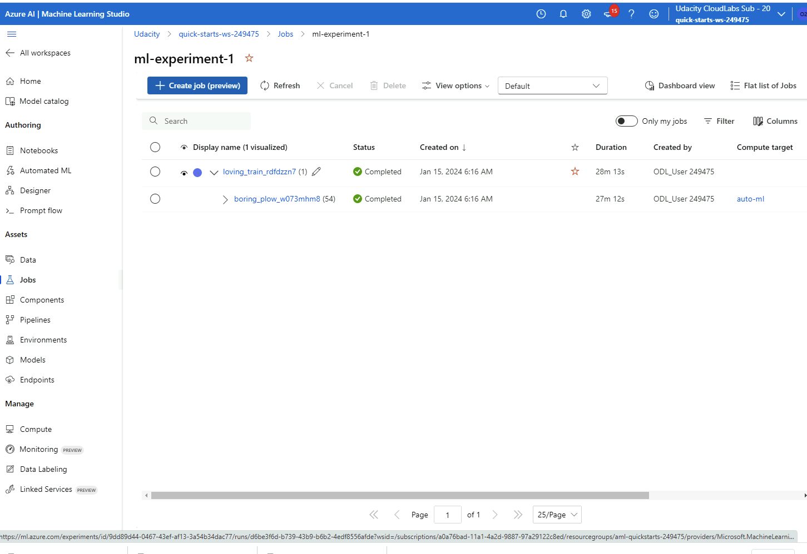
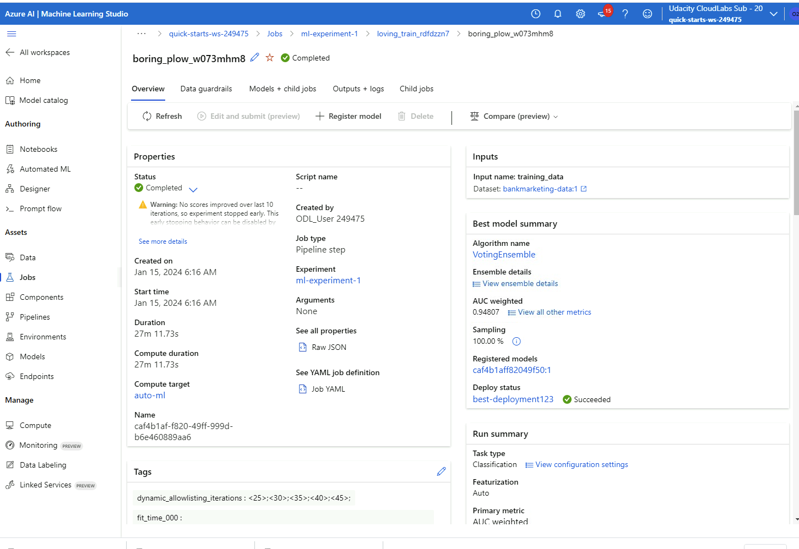

# Project 2: Operationalizing Machine Learning

## Overview

In this second project of the Udacity Azure ML Nanodegree, we deployed a model, consumed the endpoint of the model and created a pipeline for the workflow. For the first part, an AutoML run was set up which tested several models on a classification task on the bankmarketing dataset. We then selected the best model (with the highest accuracy) from the AutoML run part to deploy it. Here, enabling Application Inisights and logging was an important part of the exercise. 

To consume the endpoints we first use the swagger tool which helps document and consume RESTful web services deployed via Azure ML. For this, a swagger.json is provided through the Azure ML UI. By running the swagger.sh and serve.py scripts, we see the contents of the API for the model and the HTTP requests that are supported in the localhost website.

Finally, we automate the process by using the Pipeline class of the Python SDK in the provided jupyter notebook. Here, an AutoML run was initiaded, a best model obtained, an endpoint is created and we evaluate the model in the end. Further, a REST endpoint of the Pipeline was created.

## Project Architecture

## Project Steps

### Run AutoML Experiment and view best model

Registered Dataset with the Bankmarketing dataset: 

The experiment is completed:

Overview of the experiment with best model summary:

Details of the best model:

### Deploy the model and enable logging

Application Insights are enabled:

Logging outputs:

### Swagger Documentation

Swagger running on localhost:

### Consume Model Endpoints

Output of endpoint.py in Terminal:

### Create, publish and consume a pipeline

The pipeline has been created:

Pipeline endpoint:

Published Pipeline Overview with status ACTIVE:

RunDetails Widget:

Here, unfortunately, executing the cells in the notebook did not produced the expected widgets (even though there was no error message). I investigated the problem to no avail and unfortunately ran out of time in my lab session. See the following screenshots for the code cells and output:

Completed experiment run of the pipeline:

Everything can also be checked in the accompagnying screencast Video:

<iframe width="560" height="315" src="https://youtu.be/ZrFv812zXNk" frameborder="0" allowfullscreen></iframe>

