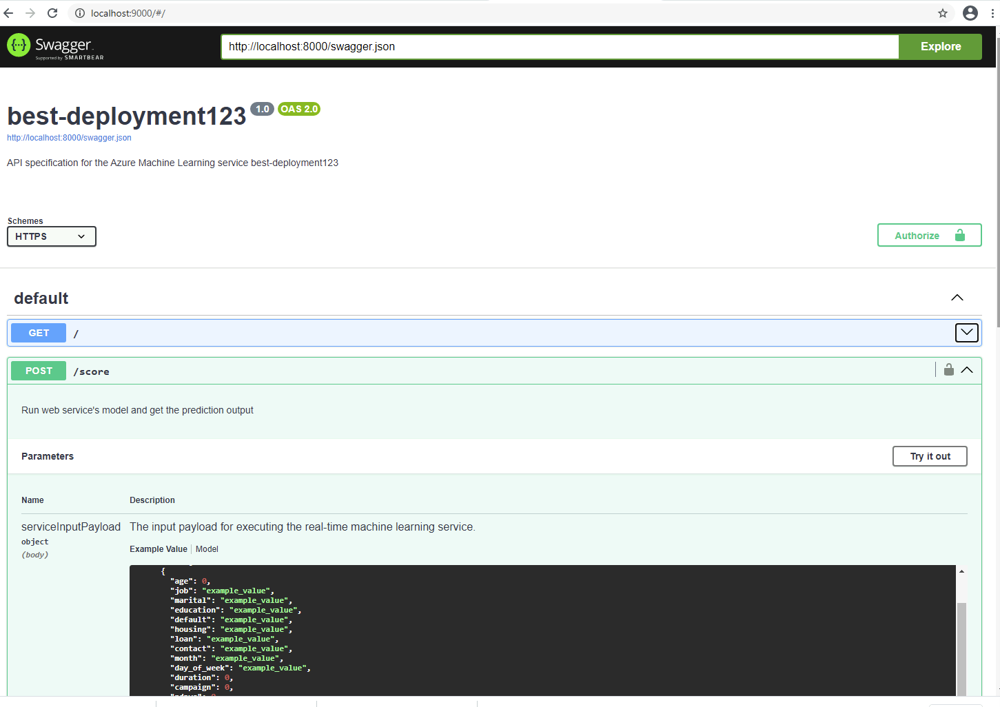

# Project 2: Operationalizing Machine Learning

## Overview

In this second project of the Udacity Azure ML Nanodegree, we deployed a model, consumed the endpoint of the model and created a pipeline for the workflow. For the first part, an AutoML run was set up which tested several models on a classification task on the bankmarketing dataset. We then selected the best model (with the highest accuracy) from the AutoML run part to deploy it. Here, enabling Application Inisights and logging was an important part of the exercise. 

To consume the endpoints we first use the swagger tool which helps document and consume RESTful web services deployed via Azure ML. For this, a swagger.json is provided through the Azure ML UI. By running the swagger.sh and serve.py scripts, we see the contents of the API for the model and the HTTP requests that are supported in the localhost website.

Finally, we automate the process by using the Pipeline class of the Python SDK in the provided jupyter notebook. Here, an AutoML run was initiaded, a best model obtained, an endpoint is created and we evaluate the model in the end. Further, a REST endpoint of the Pipeline was created.

## Project Architecture

## Project Steps

### Run AutoML Experiment and view best model

In this screenshot, you can see the registered Datasets in the workspace with the Bankmarketing dataset. The dataset was retreived from the provided url and then created as tabular dataset through the Azure ML Studio UI. All columns were left at the default values.

Here you can see the completed experiment. First, a new AutoML experiment was created ("ml-experiment-1"). Then, an AmlCompute cluster was created for the comutation of the experiment, using the vm size Standard_D3_V2 as advised in the project guidelines. Using the previously registered dataset, the experiment was run with the task of a classification problem using AtoML. After about 25 minutes, the experiment was completed as shown in the screenshot.

Upon clicking on the completed experiment, the best model can be viewed on the right-hand side. It turned out to be a VotingEnsemble with an AUC of 0.948.

Details of the best model can be viewed by clicking on it in the UI. From this interface, the model was deployed using the UI (see "Deploy" button) as instructed in the project guidelines.

### Deploy the model and enable logging

The model was deployed as a web-service using ACI and with Authentication enabled.  Then, Application Insights was enabled by running the logs.py file with the setting for enabling Application Insights set on "True". We can see that Application Insights was succesfully enabled in the following screenshot:

Again, by running the logs.py file, the logs can be viewed in the Git Bash Temrinal:

### Swagger Documentation

In the next step, I consumed the deployed model using Swagger.  For this, I first downloaded the file swagger.json from the URI provided in AzureML. In swagger.sh, altered the port to 9000, ran the bash script and then ran the serve.py script (without alterations). In the following screenshots you can see that swagger could then be accessed via localhost:9000 and the contents of the API methods and responsed for the model are displayed. 

### Consume Model Endpoints

Next,  I used the endpoint.py script to interact with the trained model. I first modified the uri and key in the model and then ran the code which resulted in the json output as expected:

### Create, publish and consume a pipeline

Finally, the task was to create, publish and consume a pipeline to automate the workflow. This was done by executing the notebok provided in the project files. You can see the successful results in the following screenshots and the screencast:
The pipeline has been created:

The Pipeline endpoint and the dataset with the AutoML module can be viewed:

Here you can see the published Pipeline Overview with status ACTIVE:

Here you can see the "RunDetails Widget" displays the steps running. This was previously not displayed corretcly, but in a new experiment run I was able to display the widget by opening the notebook in Jupyter.

Here you can see the completed experiment run of the pipeline:

Everything can also be checked in the accompagnying screencast Video:

<iframe width="560" height="315" src="https://youtu.be/ZrFv812zXNk" frameborder="0" allowfullscreen></iframe>

### Improvement suggestions

A few things could be improved about this project: 

* The used dataset could be preprocessed, columns could be added, etc. In the project, we take the dataset as it is, but there might be a lot of potential to be gained from experiment with different transformation, additional data, etc.
* In line with the first comment, domain knowledge can be used to improve input data, but also to select models and methods for the classification task
* We could use GPU instead of CPU for faster computation that would allow us to test more models in the same time
* Another possible approach would be using deep learning, i.e., neural networks with several layers, for this task. This does not necessarily lead to improvements since NNs are not always better than traditional approaches, but it is worth a try nevertheless. Using a NN would allow us to try out a more powerful approach that maps input-output relations that cannot be grasped by traditional classification methods.

